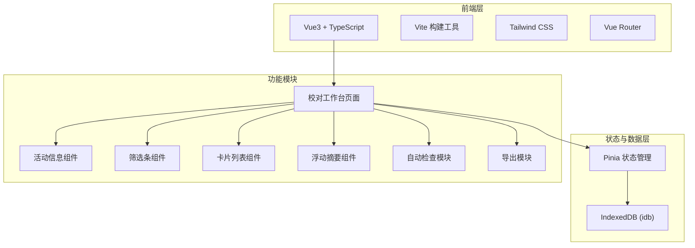
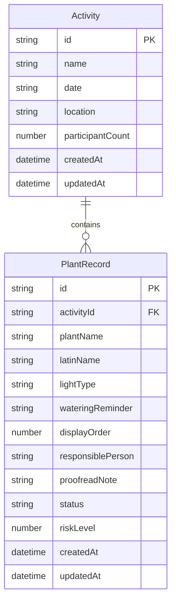

## 1. 架构设计



## 2. 技术说明

- **前端**：Vue3 + TypeScript + Vite
- **初始化工具**：vite-init (vue-ts 模板)
- **样式**：Tailwind CSS
- **状态管理**：Pinia
- **路由**：Vue Router (单页应用)
- **后端**：无（纯前端）
- **数据库**：IndexedDB（通过 idb 库操作）
- **拖拽**：vuedraggable@next
- **图标**：lucide-vue-next
- **字体**：Google Fonts (Playfair Display + Noto Sans SC)

## 3. 路由定义

| 路由 | 用途 |
|------|------|
| / | 校对工作台主页 |

## 4. 数据模型

### 4.1 数据模型定义



### 4.2 数据定义

**Activity 表 (IndexedDB: activities)**

| 字段 | 类型 | 说明 |
|------|------|------|
| id | string | UUID |
| name | string | 活动名称 |
| date | string | 活动日期 |
| location | string | 活动地点 |
| participantCount | number | 参与人数 |
| createdAt | datetime | 创建时间 |
| updatedAt | datetime | 更新时间 |

**PlantRecord 表 (IndexedDB: plant_records)**

| 字段 | 类型 | 说明 |
|------|------|------|
| id | string | UUID |
| activityId | string | 所属活动 ID |
| plantName | string | 植物名称 |
| latinName | string | 拉丁名 |
| lightType | string | 适合光照（全日照/半日照/耐阴/喜散射光） |
| wateringReminder | string | 浇水提醒 |
| displayOrder | number | 展示序号 |
| responsiblePerson | string | 责任人 |
| proofreadNote | string | 校对备注 |
| status | string | 校对状态（待补充/待校对/可打印/暂不展示） |
| riskLevel | number | 风险等级（0=无/1=低/2=中/3=高） |
| createdAt | datetime | 创建时间 |
| updatedAt | datetime | 更新时间 |

## 5. 项目目录结构

```
src/
├── components/
│   ├── ActivityInfo.vue        # 活动信息区
│   ├── FilterBar.vue           # 筛选条
│   ├── PlantCard.vue           # 单条植物卡片
│   ├── PlantCardList.vue       # 卡片列表（含拖拽）
│   ├── FloatingSummary.vue     # 右侧浮动摘要
│   ├── AutoCheckPanel.vue      # 自动检查面板
│   ├── BatchActions.vue        # 批量操作
│   └── ExportMenu.vue          # 导出菜单
├── composables/
│   ├── useIndexedDB.ts         # IndexedDB 操作封装
│   ├── useAutoCheck.ts         # 自动检查逻辑
│   ├── useExport.ts            # 导出功能
│   └── useDragSort.ts          # 拖拽排序逻辑
├── stores/
│   ├── activity.ts             # 活动信息 store
│   └── plantRecords.ts         # 植物记录 store
├── types/
│   └── index.ts                # 类型定义
├── pages/
│   └── ProofreadingWorkbench.vue  # 校对工作台主页面
├── utils/
│   └── idb.ts                  # IndexedDB 初始化
├── App.vue
└── main.ts
```

## 6. 关键技术决策

### 6.1 IndexedDB 方案

使用 `idb` 库（轻量 IndexedDB Promise 封装），创建 `plant_proofreading` 数据库，包含 `activities` 和 `plant_records` 两个对象仓库。`plant_records` 以 `activityId` 建立索引，支持按活动查询。

### 6.2 拖拽排序方案

使用 `vuedraggable@next`（基于 SortableJS），绑定 `v-model` 实现列表拖拽重排，拖拽结束后自动更新所有记录的 `displayOrder` 并持久化到 IndexedDB。

### 6.3 自动检查策略

- **名称重复**：遍历所有记录的 plantName，重复项标记为高风险
- **序号断档**：检查 displayOrder 是否连续，缺失序号标记为中风险
- **浇水提醒缺失**：wateringReminder 为空标记为中风险
- **责任人任务过多**：统计每个责任人记录数，超过阈值（默认5条）标记为低风险

### 6.4 导出方案

- **CSV**：使用浏览器原生 Blob + URL.createObjectURL 生成下载链接
- **打印版 HTML**：生成独立 HTML 字符串，通过 window.open + document.write 输出到新窗口，调用 window.print()
- **打印前校对清单**：汇总所有检查结果和记录状态，生成格式化 HTML
